<div align="center">
  <h1>🌾 KrishiTech - Smart Farming Solutions</h1>
</div>


<div align="center">
  
[](https://agri-aid-launchpad.lovable.app)
[](LICENSE)
[](https://python.org)
[](https://tensorflow.org)
[]()

</div>

**Empowering farmers with AI-driven insights for optimal crop selection and fertilizer recommendations. Make data-driven decisions to maximize your harvest and sustainability.**


## 🚀 Overview

KrishiTech is an intelligent farming platform that leverages machine learning to provide farmers with data-driven agricultural recommendations. Our solution helps optimize crop selection and fertilizer usage, leading to increased productivity and sustainable farming practices.

## ✨ Features

### 🌱 Crop Recommendation System
- **Smart Crop Selection**: AI-powered recommendations based on soil and environmental conditions
- **Multi-parameter Analysis**: Considers nitrogen, phosphorus, potassium, temperature, humidity, pH, and rainfall
- **Accuracy-focused**: Built on robust machine learning models trained on agricultural datasets
- **Real-time Predictions**: Instant recommendations through our web interface

### 🧪 Fertilizer Recommendation System
- **Optimal Fertilizer Suggestions**: Customized fertilizer recommendations for maximum yield
- **Soil-specific Analysis**: Takes into account soil color, crop type, and nutrient levels
- **Cost-effective Solutions**: Helps reduce fertilizer waste and costs
- **Environmental Impact**: Promotes sustainable farming practices

## 🏗️ Architecture

### System Architecture Overview

```mermaid
graph TD
    A[🌐 Web Interface<br/>User Input] --> B[🔧 Flask Backend<br/>Data Processing]
    B --> C[🤖 ML Model<br/>Random Forest]
    C --> D[🌱 Crop Result<br/>Display Output]
    D --> A
    
    E[💾 Model File<br/>random_forest_model.pkl] --> C
    
    style A fill:#e8f5e8,stroke:#2e7d32,stroke-width:2px,color:#000
    style B fill:#e3f2fd,stroke:#1976d2,stroke-width:2px,color:#000
    style C fill:#e0f2f1,stroke:#00695c,stroke-width:2px,color:#000
    style D fill:#fff8e1,stroke:#f9a825,stroke-width:2px,color:#000
    style E fill:#fafafa,stroke:#616161,stroke-width:2px,color:#000
```



### Recommendation Workflow

```mermaid
graph TD
    A[📝 User Input<br/>Agricultural Parameters] --> B[🔍 Data Validation<br/>& Processing]
    
    B --> C[🤖 Machine Learning<br/>Model Prediction]
    
    C --> D[📊 Result Generation<br/>& Mapping]
    
    D --> E[📱 Display Output<br/>Recommendation]
    
    style A fill:#e8f5e8,stroke:#2e7d32,stroke-width:2px,color:#000
    style B fill:#fff3e0,stroke:#f57c00,stroke-width:2px,color:#000
    style C fill:#e0f2f1,stroke:#00695c,stroke-width:2px,color:#000
    style D fill:#e8eaf6,stroke:#3f51b5,stroke-width:2px,color:#000
    style E fill:#f1f8e9,stroke:#558b2f,stroke-width:2px,color:#000
```



## 🛠️ Technology Stack

- **Frontend**: HTML5, CSS3, JavaScript, Bootstrap
- **Backend**: Python, Flask/Django
- **Machine Learning**: Scikit-learn, Pandas, NumPy
- **Database**: SQLite/PostgreSQL
- **Deployment**: Docker, Heroku/AWS
- **Version Control**: Git, GitHub

## 📊 Input Parameters

### Crop Recommendation Inputs
| Parameter | Description | Unit | Range |
|-----------|-------------|------|-------|
| Nitrogen (N) | Nitrogen content in soil | kg/ha | 0-140 |
| Phosphorus (P) | Phosphorus content in soil | kg/ha | 5-145 |
| Potassium (K) | Potassium content in soil | kg/ha | 5-205 |
| Temperature | Average temperature | °C | 8-43 |
| Humidity | Relative humidity | % | 14-99 |
| pH | Soil pH level | pH units | 3.5-9.9 |
| Rainfall | Annual rainfall | mm | 20-298 |

### Fertilizer Recommendation Inputs
| Parameter | Description | Type | Options |
|-----------|-------------|------|---------|
| Temperature | Current temperature | °C | 0-50 |
| Soil Color | Visual soil color | Category | Black, Red, Brown, Yellow |
| Crop | Target crop type | Category | Rice, Wheat, Maize, etc. |
| Nitrogen (N) | Current N level | kg/ha | 0-140 |
| Phosphorus (P) | Current P level | kg/ha | 5-145 |
| Potassium (K) | Current K level | kg/ha | 5-205 |

## 🎯 Usage Examples

### Crop Recommendation
```python
# Example input for crop recommendation
input_data = {
    'nitrogen': 90,
    'phosphorus': 42,
    'potassium': 43,
    'temperature': 20.87,
    'humidity': 82.0,
    'ph': 6.5,
    'rainfall': 202.9
}
# Expected output: "Rice"
```

### Fertilizer Recommendation
```python
# Example input for fertilizer recommendation
input_data = {
    'temperature': 26,
    'soil_color': 'Black',
    'crop': 'Rice',
    'nitrogen': 37,
    'phosphorus': 0,
    'potassium': 0
}
# Expected output: "Urea"
```

## 📈 Model Performance

| Model | Accuracy | 
|-------|----------|
| Crop Recommendation | 98.73% | 
| Fertilizer Recommendation | 91.80% | 


## 🚀 Getting Started

### Prerequisites
```bash
Python 3.8+
pip package manager
Git
```

### Installation

1. **Clone the repository**
```bash
git clone https://github.com/swapnil-patil8767/KrishiTech.git
cd KrishiTech
```

2. **Create virtual environment**
```bash
python -m venv venv
source venv/bin/activate  # On Windows: venv\Scripts\activate
```

3. **Install dependencies**
```bash
pip install -r requirements.txt
```

4. **Run the application**
```bash
python app.py
```

5. **Access the application**
```
Open your browser and navigate to: http://localhost:5000
```


## 📄 License

This project is licensed under the MIT License - see the [LICENSE](LICENSE) file for details.


